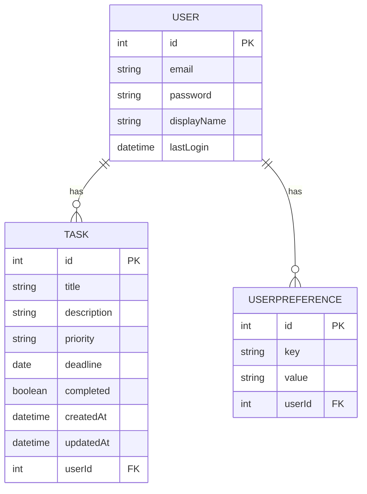

# Task Management & To-Do Application — Project Report

This document is a comprehensive project report for the Task Management & To-Do Application. It follows the requested structure and includes problem statement, ER diagram, database schema, normalization notes, system requirements, design, implemented modules, code snippets, screenshots guidance, and instructions for publishing the source.

---

## 1. Problem Statement

Many people and small teams need a lightweight, offline-capable desktop app to track tasks, deadlines and priorities with user-specific preferences. The goal of this project is to build a desktop Task Management and To-Do application with the following requirements:

- Allow users to register and authenticate locally.
- Allow each user to create, read, update and delete (CRUD) tasks.
- Capture task metadata: title, description, priority (High/Medium/Low), deadline, completed status, timestamps.
- Support user-specific preferences (theme, default sort order, etc.).
- Provide a clean, elegant UI for efficient task management (JavaFX + FXML + custom CSS).
- Persist data locally using Hibernate (JPA) so the app is usable offline.

Challenges:

- Correctly mapping object model to relational schema and managing relationships (Task -> User).
- Keeping the UI responsive while doing DB operations (use background threads if needed).
- Packaging JavaFX applications correctly across platforms (JavaFX modules and runtime).
- Delivering a polished UI and intuitive user experience within desktop constraints.

---

## 2. ER Diagram

Below is a simple ER representation (ASCII and Mermaid) showing the main entities and relationships.

ASCII:

# Task Management & To-Do Application — Project Report

Prepared for: [Course / Instructor]

Submitted by: [Your Name]

Date: 19-10-2025

Overview
--------
This document is a comprehensive project report prepared to satisfy the submission requirements. It describes the problem, data model, database schema and normalization, system requirements and design, implemented modules, code snippets highlighting key functionality, screenshots instructions, and GitHub publishing steps.

1. Problem Statement
---------------------
Problem summary

Individuals and small teams need a lightweight, offline-capable desktop application to manage tasks and to-dos with user-specific preferences. The goal of this project is to build a secure, user-centric Task Management application with an elegant UI and persistent storage.

Functional requirements
- User registration, authentication and profile (email, password, display name).
- Create, read, update, delete (CRUD) tasks per user.
- Task metadata: title (required), description, priority (High/Medium/Low), deadline, completion status, timestamps.
- User preferences stored as key/value pairs (theme, sort order).
- Clean, polished UI using JavaFX (FXML + CSS) for desktop use.
- Local persistence using Hibernate (JPA) to support offline operation.

Non-functional requirements
- Security: passwords must be stored securely (recommendation: use BCrypt in production).
- Usability: minimal steps for common actions (add, complete, filter tasks).
- Maintainability: modular design separating UI, services and persistence.

Constraints and assumptions
- The sample app uses a relational database via Hibernate; the default configuration is local and suitable for development.
- The scope covers a single-user session per running instance; concurrency for multiple simultaneous users is out-of-scope.

2. ER diagram
-------------
I created a vector ER diagram located at `docs/images/er_diagram.svg`. Logical relationships:

- User (1) — (N) Task
- User (1) — (N) UserPreference

Entities & attributes (summary)
- User: id (PK), email, password, display_name, last_login
- Task: id (PK), title, description, priority, deadline, completed, created_at, updated_at, user_id (FK)
- UserPreference: id (PK), key, value, user_id (FK)

Mermaid snippet (renderable by supported tools):



3. Database schema (DDL)
-------------------------
The following DDL is suitable for PostgreSQL or H2 (development). Adjust types for other RDBMS as needed.

```sql
CREATE TABLE users (
  id SERIAL PRIMARY KEY,
  email VARCHAR(255) NOT NULL UNIQUE,
  password VARCHAR(255) NOT NULL,
  display_name VARCHAR(255),
  last_login TIMESTAMP
);

CREATE TABLE tasks (
  id SERIAL PRIMARY KEY,
  title VARCHAR(255) NOT NULL,
  description TEXT,
  priority VARCHAR(20),
  deadline DATE,
  completed BOOLEAN DEFAULT FALSE,
  created_at TIMESTAMP,
  updated_at TIMESTAMP,
  user_id INTEGER NOT NULL,
  CONSTRAINT fk_user FOREIGN KEY(user_id) REFERENCES users(id) ON DELETE CASCADE
);

CREATE TABLE user_preferences (
  id SERIAL PRIMARY KEY,
  key VARCHAR(100) NOT NULL,
  value VARCHAR(1024),
  user_id INTEGER NOT NULL,
  CONSTRAINT fk_user_pref FOREIGN KEY(user_id) REFERENCES users(id) ON DELETE CASCADE
);
```

Indexes and performance notes
- Add an index on `tasks(user_id, created_at)` to speed up per-user listing and sorting.
- Index `users(email)` is already covered by the UNIQUE constraint.

4. Database normalization
--------------------------
- 1NF: All attributes are atomic and tables have no repeating groups.
- 2NF: Non-key attributes depend on the whole primary key (single-column surrogate keys are used).
- 3NF: There are no transitive dependencies; user-specific settings are factored into `user_preferences`.

Rationale

Storing preferences in a separate table avoids schema changes for every new preference and prevents a wide `users` table with many nullable columns.

5. System Requirements
-----------------------
Hardware (recommended)
- CPU: Dual-core 2GHz+ (quad-core recommended)
- RAM: 8 GB (minimum 4 GB)
- Disk: 1 GB free for code, build artifacts and DB files

Software
- JDK 11+ (OpenJDK / Oracle)
- Maven 3.6+
- JavaFX (provided by Maven dependencies/plugin)
- DB: H2 (dev) or PostgreSQL/MySQL for production
- Optional: IntelliJ IDEA for development

6. System Design (front-end & back-end)
---------------------------------------
Architecture overview

Layered desktop architecture:

- Presentation: JavaFX (FXML + Controllers) — UI and user interactions.
- Application / Service: `DatabaseService` encapsulates business operations and coordinates persistence.
- Persistence: Hibernate (JPA) with entities and `HibernateUtil` for SessionFactory.

Key modules and responsibilities
- `MainApp` — application bootstrap
- `SceneRouter` — navigation and scene handling
- `LoginController`, `DashboardController`, `TaskController` — handle UI events
- `DatabaseService` — exposes methods to register/authenticate users, CRUD tasks, manage preferences
- `HibernateUtil` — sets up `SessionFactory` using `hibernate.cfg.xml`

Sequence flow: create task
1. User invokes Add Task UI.
2. Controller constructs `Task` entity and calls `DatabaseService.saveTask(task)`.
3. `DatabaseService` opens session, begins transaction, merges/persists the entity and commits.
4. Controller refreshes task list and updates UI.

7. Core Modules Implemented
---------------------------
- Authentication & user management: Registration, login and last-login tracking.
- Task CRUD: Create, Read (list), Update, Delete tasks with priority and deadlines.
- User preferences: Key/value persistence per user.
- UI: Login and Dashboard implemented in FXML and controlled via Java classes; a refined CSS provides a professional look.

8. Code snippets (key functionality)
-----------------------------------
Representative extracts are copied from the codebase to document main functionality.

Task entity (abridged)

```java
@Entity
@Table(name = "tasks")
public class Task {
    @Id
    @GeneratedValue(strategy = GenerationType.SEQUENCE, generator = "task_seq")
    @SequenceGenerator(name = "task_seq", sequenceName = "TASK_SEQ", allocationSize = 1)
    private int id;

    @Column(nullable = false)
    private String title;
    private String description;
    private String priority; // High, Medium, Low
    private LocalDate deadline;
    private boolean completed;
    @Column(name = "created_at")
    private LocalDateTime createdAt;
    @Column(name = "updated_at")
    private LocalDateTime updatedAt;

    @ManyToOne(fetch = FetchType.LAZY)
    @JoinColumn(name = "user_id", nullable = false)
    private User user;

    @PreUpdate
    public void preUpdate() { this.updatedAt = LocalDateTime.now(); }
}
```

DatabaseService: save task (abbreviated)

```java
public Task saveTask(Task task) {
    try (Session session = HibernateUtil.getSessionFactory().openSession()) {
        Transaction tx = session.beginTransaction();
        try {
            session.merge(task);
            tx.commit();
            return task;
        } catch (Exception e) {
            tx.rollback();
            throw new RuntimeException("Failed to save task: " + e.getMessage(), e);
        }
    }
}
```

Retrieve tasks for a user

```java
public List<Task> getUserTasks(int userId) {
    try (Session session = HibernateUtil.getSessionFactory().openSession()) {
        Query<Task> query = session.createQuery(
            "FROM Task WHERE user.id = :userId ORDER BY createdAt DESC", Task.class);
        query.setParameter("userId", userId);
        return query.list();
    }
}
```

9. Screenshots (inclusion instructions)
--------------------------------------
Store screenshots in `docs/images/` and reference them in the report. Example filenames:
- `docs/images/login.png`
- `docs/images/dashboard.png`
- `docs/images/add_task.png`

To embed a screenshot in this report use:

```markdown

```

If you want, I will copy the screenshot you provided into `docs/images/` and add these references to the report.

10. GitHub repository link & submission
--------------------------------------
When ready to submit, push the project to GitHub and add the link here. Example:

`https://github.com/<your-username>/Task_Management_And_To_Do_Application`

Push steps (PowerShell)

```powershell
git remote set-url origin https://github.com/<your-username>/Task_Management_And_To_Do_Application.git
git push -u origin main
```

If you would like me to create the repo and push automatically, I can do it with your permission (you'll provide a PAT in a secure prompt).

Appendices
----------
Appendix A — Implementation notes
- Use `javafx.concurrent.Task` to keep DB work off the UI thread.
- Store passwords using BCrypt (or Argon2) in production.

Appendix B — Test plan (sample)
- Unit tests: `DatabaseService` methods using an H2 in-memory instance.
- Integration tests: launch a headless JavaFX instance and perform UI-driven flows with TestFX.

Appendix C — Files referenced
- `src/main/java/com/taskmanager/MainApp.java`
- `src/main/java/com/taskmanager/controller/*`
- `src/main/java/com/taskmanager/entity/*`
- `src/main/java/com/taskmanager/service/DatabaseService.java`
- `src/main/resources/fxml/*` and `src/main/resources/css/application.css`

Next steps I can perform for you
--------------------------------
1. Insert your screenshot(s) into `docs/images/` and embed them in this report.
2. Run the GitHub Actions workflow I added to generate PNGs for the diagrams and commit them.
3. Create a submission PDF (export of this markdown) and/or a short slide deck.

Which of those would you like me to proceed with? If you'd like the screenshots embedded, please upload them or grant permission to copy the screenshot you already provided into `docs/images/`.
